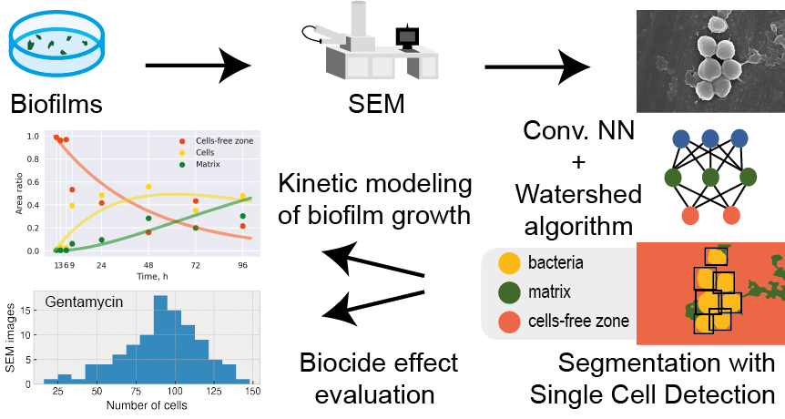

# cv4biofilms

### Digital biology approach for macroscale studies of biofilm growth and biocide effects with electron microscopy




Microbial interactions are one of the major topics of current research due to their great societal relevance. It is now established that biofilms — associations of microorganisms, exchanging various chemical compounds, including proteins and nucleic acids — are capable of promoting horizontal transfer of resistance genes. However, our understanding of the processes occurring in biofilms is rather limited. A possible method to partly overcome this problem is the implementation of highly efficient imaging and mapping of these structures. This work proposes a combination of automated scanning electron microscopy (SEM) and a comprehensive software system that uses deep neural networks to perform an in-depth analysis of biofilms. Time-dependent, high-throughput mapping of biofilm electron microscopy images was achieved using deep learning and allowed microscale data analysis of visible to the eye biofilm-covered area (i.e., at the macroscale). For this study, to the best of our knowledge, the first matrix and cell-annotated biofilm segmentation dataset was prepared. We show that the presented approach can be used to process statistical data investigation of biofilm samples in a volume, where automation is essential (>70 000 separate bacterial cells studied; >1000 times faster than regular manual analysis). To evaluate the approach, multiple time steps of biofilm development were analyzed by first-to-date kinetic modeling of biofilms with SEM, revealing the complex dynamics of biofilm formation. Moreover, it was shown that the described procedure is capable of capturing differences between antibiotics and antimicrobial compounds applied to studied biofilms.

Here, The code for the article "Digital biology approach for real scale studies of biofilms growth and biocides effect" is presented.


[Follow us](http://ananikovlab.ru)

## How to use it?

1. If you want to train your own model, you have to run *./train_network.py*

Example:

```python
python train_network.py --path data/cell_data_3A.pkl --arch_name UNet --encoder_name resnet34 --batch_size 5 --crop_size 896 --optimizer_name Adam --savelogdir test_model_training --elastic_transform_size 5
```
P.S. You can change augmentations during training in *network_training/augmentations.py* 


2. If you want to check test examples, you have to run *network_training/test_examples.py*

Example:

```python
python test_examples.py --split test --report_images_output_dir data/test_sample_model_preds --checkpoint_path final_models/final_model.ckpt
```


3. Examples of using the model for SEM images segmentation are shown in *img_analysis_at_scale/large_scale_segmentation.py*, *kinetic_modeling/seg_model_for_kinetic_modeling.py* and *mapping-4-antibiotics-impact/seg_model_for_antibiotics.py*


4. If you want to use cell detection on images, you have previosly to perform image segmentation. After that, you can use function *detect_cells()* from *cell_detection/cell_detection.py*

### Data

All data and networks, used in the research article is located [here](https://mega.nz/folder/zvhFjIJZ#wjaRa-D1ja6YEa0ZZjl--g)

If you want to run the scripts and jupyter notebooks, it is recommended to locate all necessary files in the *./data/* directory.

It is also reccomemded to locate all *.ckpt* files in the *./final_models/* directory.
